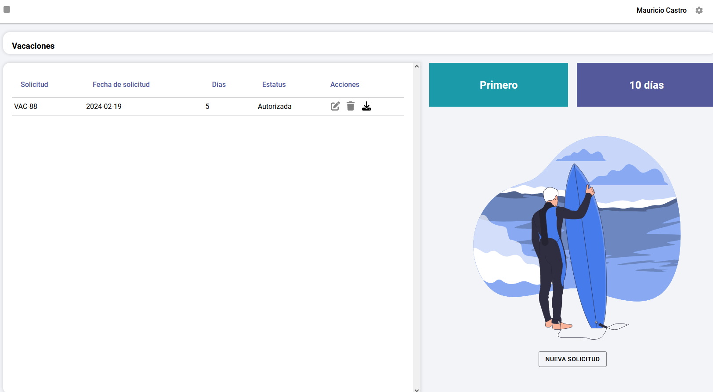
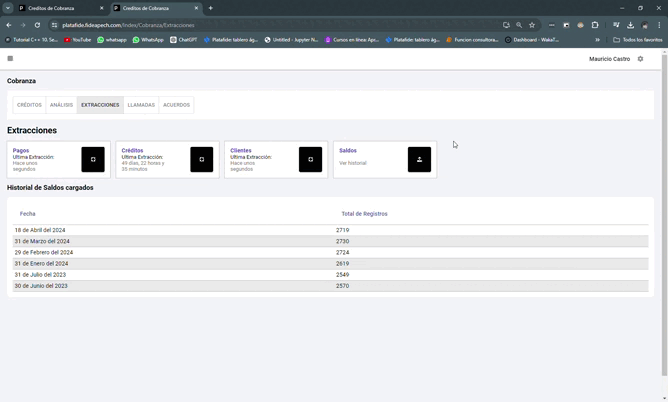

# Manual Platafide
## Índice 
#### 1. [Introducción](#introducción)
#### 2. [Instalación](#instalación)
* ##### 2.1 [Cliente](#cliente)
* ##### 2.2 [Servidor](#servidor)
* ##### 2.3 [Base de Datos](#base-de-datos)
* ##### 2.4 [Ejecución](#ejecución)
#### 3. [Modulos](#modulos)
* ###### 3.1 [Pagina principal y Login](#pagina-principal-y-login)
    * ###### 3.1.1 [Login](#login)
* ###### 3.2 [Configuración](#configuración)
* ###### 3.3 [Herramientas](#herramientas)
* ###### 3.4 [Dirección](#dirección)
* ###### 3.5 [Administrativos](#administrativos)
* ###### 3.6 [Jurídico](#jurídico)
* ###### 3.7 [Promoción](#promoción)
* ###### 3.8 [IT](#it)
* ###### 3.9 [Mesa de Control](#mesa-de-control)
* ###### 3.10 [KPIs](#kpis)
* ###### 3.11 [Cobranza](#cobranza)

<a id="introducción"></a>
## 1. Introducción

Platafide es una plataforma de gestión de procesos internos la cual se maneja por modulos, cada modulo tiene un objetivo de proceso especifico, inicialmente la plataforma se creo para digitalizar procesos tediosos como lo son los viaticos y vacaciones, poco a poco se fue expandiendo a otros procesos internos de la empresa haciendo que esta plataforma este en constante actualización.

<a id="instalación"></a>
## 2. Instalación

Para tener contexto de como funciona la plataforma es necesario entender que es una plataforma la cual esta dividida en 3 partes, el cliente, el servidor y la base de datos.

Cada parte tiene sus requisitos los cuales son los siguientes:

<a id="cliente"></a>
### 2.1 Cliente

* Es necesario tener instalado node Js, para instalarlo puede ir a la siguiente pagina [Node Js](https://nodejs.org/es/)

* Tener Instalado Git

* Clonar el repositorio de la plataforma en la siguiente dirección [Platafide-Cliente](https://github.com/FideapechSIDE/Platafide-Cliente.git)
* Instalar Node en la raíz del proyecto con el siguiente comando:
```bash
npm i
```
* Instalar SASS en la raíz del proyecto con el siguiente comando:
```bash
npm i sass
```
* Instalar Font Awesome en la raíz del proyecto con el siguiente comando:
```bash
npm i --save @fortawesome/fontawesome-svg-core
npm i --save @fortawesome/free-solid-svg-icons
npm i --save @fortawesome free-regular-svg-icons
npm i --save @fortawesome/react-fontawesome@latest
```
* Instalar Router Dom en la raíz del proyecto con el siguiente comando:
```bash
npm i react-router-dom
```
* Instalar Sweet Alert en la raíz del proyecto con el siguiente comando:
```bash
npm i sweetalert2
```
* Instalar Material UI en la raíz del proyecto con el siguiente comando:
```bash
npm install @mui/material @emotion/react @emotion/styled
npm install @mui/x-date-pickers
npm install dayjs
npm install @mui/lab @mui/material
```

* Instalar Axios en la raíz del proyecto con el siguiente comando:
```bash
npm i axios
```
<a id="servidor"></a>
### 2.2 Servidor

* Tener instalado Python 3.11

* Tener Instalado Git

* Clonar el repositorio de la plataforma en la siguiente dirección [Platafide-Servidor](https://github.com/FideapechSIDE/Platafide-Servidor)

* Crear un entorno virtual en la raíz del proyecto con el siguiente comando:
```bash
python -m venv env
```
* Activar el entorno virtual con el siguiente comando:

Windows:
```bash
env\Scripts\activate
```
Linux:
```bash
source env/bin/activate
```

Instalar las dependencias del proyecto con el siguiente comando:
```bash
pip install -r requirements.txt
```

Crear archivo .env a partir del archivo env-like en la raíz del proyecto

<a id="base-de-datos"></a>
### 2.3 Base de Datos

* Tener instalado MySQL 8.0

* Ejecutar Migrations:

Crear base de datos con el nombre de "platafide"

Correr archivos sql individualmente para reparar tablas de relaciones(Actualización)

<a id="ejecución"></a>
### 2.4 Ejecución


Para ejecutar la plataforma en debug  de manera local(en la misma computadora) es necesario tener corriendo el servidor y el cliente, para correr el servidor es necesario ejecutar los siguientes comandos en sus respectivas carpetas:


Cliente:

Correr el siguiente comando en la raíz del proyecto cliente:

```bash
npm start
```

Servidor:

Correr el siguiente comando en la raíz del proyecto servidor:

```bash
python index.py
```

Para ejecutar la plataforma en producción es necesario tener corriendo el servidor y el cliente, para correr el servidor es necesario configurarlos correspondientemente la cual es la siguiente:

Para linux usar: nginx + gunicorn

Para windows usar: IIS + wfastcgi

El usuario y contraseña por defecto es: admin y Admin123

<a id="modulos"></a>
## 3. Modulos

La plataforma esta dividida en modulos los cuales mes a mes se van actualizando o creando nuevos, actualmente contamos con los siguientes:

<a id="pagina-principal-y-login"></a>
### 3.1 Pagina principal y Login

#### Login

Con lo primero que nos encontramos al ingresar a la plataforma es la pagina de inicio de sesión, en la cual tenemos la opción de ingresar o restaurar nuestra contraseña en caso de haberla olvidado.


No existe la opción de registro ya que los usuarios son creados por el administrador de la plataforma o las personas con los permsisos necesarios para crearlos.


Para restaurar la contraseña es necesario ingresar el correo electronico con el cual se registro en la plataforma, en caso de no recordar el correo electronico es necesario contactar al administrador de la plataforma.

Al introducir el correo electronico se enviara un correo con una nueva contraseña a la persona.

#### Pagina Principal


La pagina principal muestra al usuario a todos los modulos a los cuales tiene permiso acceder 

##### Barra Superior


La barra superior estara disponible en todos los menus y submenus, esta barra cuenta con tres opciones las cuales son:

Recuadro amarillo (Cuadrado): Sirve para regresar a la pagina principal

Recuadro azul (Nombre de Usuario): Sirve para ver la pestaña de perfil el cual incluye el nombre, departamento, jefe directo fecha de ingreso e información sobre platafide.

Recuadro rojo (Engranaje): Sirve para cerrar sesión.

<a id="configuración"></a>
### 3.2 Configuración


El modulo de configuración tiene sus respectivos sub modulos los cuales son:

#### Usuarios, Jefes y Departamentos

Para navegar entre sub modulos es necesario dar click en el cuadrado negro con el nombre del sub modulo.

##### Usuarios


Esta opción del sub modulo funciona para agregar,editar y eliminar usuarios de la plataforma

###### Agregar Usuario

Video de como agregar un usuario:


###### Editar Usuario

Video de como editar un usuario:


###### Eliminar Usuario

Video de como eliminar un usuario:


##### Departamentos

Esta opción del sub modulo funciona para agregar,editar y eliminar Departamentos de la plataforma

###### Agregar Departamento

Video de como agregar un departamento:


###### Editar Departamento

Video de como editar un departamento:


###### Eliminar Departamento

video de como eliminar un departamento:


##### Jefes

Esta opción del sub modulo funciona para agregar,editar y eliminar jefes de la plataforma

###### Agregar Jefe

Video de como agregar un jefe:


###### Editar Jefe

Video de como editar un jefe:


###### Eliminar Jefe

Video de como eliminar un jefe: 


#### Opciones de Usuario


El apartado de Opciones de usuarios es para configurar las opciones de ciertos usuarios, el numero de registro como la función debe de seguir el orden establecido en la imagen.

La explicación de cada registro es la siguiente:

1 Recibe Oficio de Comisión : Es el usuario que recibira los oficios de comisión(En el proceso de viaticos) para su firma.

2 Recibe Comprobación de Gastos : Es el usuario que recibira las comprobaciones de gastos(En el proceso de viaticos) para su firma.

3 Recibe informe de actividades: Es el usuario que recibira los informes de actividades(En el proceso de viaticos) para su firma.

4 Correo receptor de archivos: Es el correo que recibira los archivos de los viaticos una vez concluidos.

5 Autorizar Vacaciones: Es el usuario que autorizara las vacaciones para su firma.

6 Recibir Vacaciones: Es el usuario que recibira las vacaciones para su firma.

7 Soporte: A partir de este campo el registro deja de tener una función especifica, la función de soporte sirve para el sistema de tickets internos de platafide, es importante agregar que tiene la función de soporte.

8 Recibir Resguardos: Es el usuarrio que recibira los resguardos del control de activos para su firma.

Las opciones de editar, añadir tienen que tomarse con precaución ya que afectan directamente a la plataforma, por lo mismo la función de eliminar esta desactivado.

La opcion de valor funciona para agregar un correo externo a la plataforma, el cual recibira los documentos, en caso de que requiera firmar se necesita que el usuario que se quiere seleccionar este dado de alta en usuarios .

Video de Como Agregar y Editar Opciones de Usuario:


#### Permisos de Usuario


El apartado de Permisos de usuarios es para configurar los permisos de ciertos usuarios, se selecciona el departamento para luego seleccionar el usuario y asignarle los permisos a los modulos que se deseen.

Video de como asignar permisos a un usuario:


#### Configuración de la aplicación


El apartado de Configuración de la aplicación es para configurar la aplicación de la plataforma, Principalmente el logo de la empresa, este debe ser subido en fomato png y transpartente, el tamaño recomendado es que el logo tenga un ancho superior al alto.


#### Catalogos


Esta pagina esta enfocada en los catalogos actuales y futuros de la plataforma, estos catalogos hacen referencia a ciertas variables que se utilizan en la plataforma.

Tenemos el caso de activos para agendar el cual se le da click y entramos a una interfaz la cual nos permite, cargar, activarlo o desactivarlo.

Este catalogo de activos es utilizado en el modulo de herramientas en el proceso de reservar activos.

Video de como crear, activar y desactivar activos:


<a id="herramientas"></a>

### 3.3 Herramientas


Este modulo esta enfocado en las herramientas que se utilizan en la plataforma, actualmente contamos con las siguientes herramientas:

#### Zoom


Esta herramienta esta enfocada en la creación de reuniones de zoom, para poder utilizar esta herramienta es necesario tener una cuenta de zoom y tener el token de la cuenta el cual se coloca en las variables de entorno del servidor.


Significado de los iconos:

El icono de correo funciona para copiar la invitación a la reunión en el porta papeles.

El icono de encender funciona para iniciar la reunión, la reunión establece como host al usuario que da click en el icono.

El icono de eliminar funciona para eliminar la reunión.

Video del proceso de creación e inicio de reunión:


#### Soporte


Esta herramienta esta enfocada en el sistema de tickets de soporte, esta interfaz esta dividida en dos partes, la cual es la solcitud de tickets y la recepción de tickets, en este apartado se solicitan los tickets.


Los tickets tienen 4 estados los cuales son:

En espera: El ticket esta en espera de ser atendido y este es el estatus por default.

En proceso: El ticket esta siendo atendido por el soporte.

Pendiente: El ticket ya fue visto pero se necesita mas información para poder resolverlo.

Cerrado: El ticket ya fue resuelto.

#### Reservar Activos


Este apartado esta enfocado en la reserva de activos, los activos son los que se encuentran en el catalogo de activos, para poder reservar un activo es necesario seleccionar el activo, escojer el mes para luego seleccionar el dia y la hora, una vez seleccionado se da click en la hora de reserva la cual esta dividido por intervalos de 30 minutos, unicamente se muestran 2 meses (el actual y el siguiente), no se puede apartar ni anular reuniones ya pasadas para evitar la manipulación de datos.

Video de como reservar un activo:


Una persona no puede reservar a la misma hora el mismo activo que otra persona ni modificar reservas de personas externas, el calendario muestra las reservas de todos los usuarios.

<a id="dirección"></a>
### 3.4 Dirección


En este modulo se encuentran los procesos de la dirección, los cuales son:

#### Control de Oficios

El sub modulo de control de oficios esta enfocado en el control de los oficios que se envian y reciben para su correcto registro.


En esta interfaz, podremos observar los oficios que hemos enviado. Podremos ver detalles como si llegaron, si se confirmó su recibo y otros datos del oficio. Además, podremos descargar el archivo y eliminarlo.


En los detalles del oficio se puede apreciar la informaciónd el oficio en la que destaca el estauts del correo que le llego a la persona, en caso de que haya sido enviado con exito se mostrara una palomita verde, en caso de que no se haya enviado se mostrara una equis roja y en caso de que la persona confirme de recibido se mostrara una palomita azul.

Como enviar un oficio:


Se debe seleccionar si es un oficio que se recibio o se va a enviar, y completar los campos con la información necesaria, e incluir el archivo(este tiene que estar en pdf), una vez completado se da click en continuar para seleccionar contactos de la agenda de contactos y enviar el oficio.

Agenda de Contactos:


Cada persona tiene su propia agenda de contactos, en la cual se pueden agregar y eliminar contactos, estos contactos son utilizados para enviar oficios.

Confirmar recepción de oficio


Una vez que se envia el ofició el usuarios confirma de recepción en esta confirmación le llega un link y el archivo del oficio.

Al acceder a ese link se le mostrara una pantalla en la cual se le pedira confirmar la recepción del oficio con su firma y nombre.

Al completar la recepción al usuario le llegara un acuse de recepción y en la plataforma de oficios podremos observar la palomita azul de que la persona lo recibio.


Confirmar si el archivo no es apocrifo y se envio usando platafide.

Al usar la dirección DominioPlataforma/Comprobar-Oficio


podremos acceder a una interfaz donde podemos subir un archivo para saber si fue enviado en platafide y saber si fue modificado o no fue enviado por platafide.

#### Control de Expedientes


El sub modulo de control de expedientes esta enfocado en el control de los expedientes que se envian y reciben para su correcto registro y asignación por programa.

Este moudulo esta dividido en 4 partes que son las divisiones por tipo de expediente, las cuales son:

FECH: Son creditos propios de fideapech

Programas Administrados: Son creditos de programas que administra fideapech pero no son propios de fideapech

Programa Unico de Recuperación de Cartera: Que son las reestructuraciones de creditos

Subsidios: Son los subsidios que otorgan otras dependencias.

Cada modulo tiene exactamente la misma interfaz con algun cambio en los campos

Basicamente se crea un expediente con sus caracteristicas y se anotan las hojas generadas digitales y fisicamente, solo para terner un registro de los expedientes.

Uso de la interfaz:


#### PTCI


El sub modulo de PTCI esta enfocado en el plan de trabajo de control interno y las acciones de mejora a relizar con sus respectivos responsables y evidencias.

Crear Evaluacion:


Una Vez en la Evaluación se puede agregar acciones de mejora, las cuales se pueden asignar a un responsable y agregar evidencias de que la acción se llevo acabo.

Agregar Accion de mejora:


Una vez Creada la acción de mejora a la persona responsable se le notificara y se le asignara la acción de mejora por medio de un correo electronico como el siguiente:


Una vez enviado el metodo de verificación de la acción de mejora es por medio de evidencias, las cuales se pueden subir en la interfaz de la acción de mejora.

Control Interno recibira un correo electronico con la solicitud de revisión de la acción de mejora.


Una vez revisada la acción de mejora se valida y llega un correo a la persona que realizo la acción de mejora.


#### Oficios Viejo

Este modulo era la anterior version de control de oficios la cual esta depreciada y se encuentra en desuso.

Interfaz de Oficios Viejo:


<a id="administrativos"></a>

### 3.5 Administrativos


Este modulo se centra en el tema de viaticos, vacaciones y control de activos.

#### Viáticos


En viaticos podremos observar los viaticos que hemos solicitado y un boton para empezar un nuevo proceso de viaticos.

Primera etapa del proceso de viaticos:


En esta etapa se crea el informe de actividades con los siguientes pasos:

1.- Creas un nuevo viatico para luego seleccionarlo

2.- Seleccionar de donde partes, a donde vas y por cuanto tiempo

3.- Seleccionas Cuanto dura el ultimo día de tu comision(esto para saber que tarifa aplicar al ultimo día), tambien se tiene que seleccionar el rango del funcionario más alto que va en la comision, esto porque el presupuesto se empareja con el rango más alto.

4.- Seleccionar si la persona conducira un vehiculo, en caso de que si se selecciona el vehiculo y se selecciona los cilindros del vehiculo tanto como los kilometros que se van a recorrer como el combustible y el total de costo de las casetas.

5.- En caso de que necites un avion, autobus o taxi, selecciona las cantidades.

6.- Coloca la actividad que realizaras en tu comisión.

7.- Para luego pasar al sistema de firmado.


Etapa de firmado de informe de actividades:


En esta etapa se genera una vista previa del informe de actividades en la cual podemos revisar que todos los datos esten correctamente escritos, en caso de que no se tiene que volver a hacer la primera etapa de viaticos.

En este sistema de firmado se tiene que dar click en firmar y pegar nuestra firma, la firma tiene que estar en formato png y con fondo transparente, en caso de que no sea transparente el fondo blanco cubrira los campos.

Al firmar el correo de la persona que firmo recibira un correo que hace referencia a que firmo el informe de actividades.


A su vez le llegara un correo a la siguiente persona en firmar el informe de actividades, solicitando su firma.


Cuando todas las personas firmen el informe de actividades pasara a la etapa de comprobación de gastos.

Etapa de comprobación de gastos:


En esta etapa se comprueban los gastos por medio de facturas y comprobantes fiscales.

El proceso para comprobar un gasto es el siguiente:


Es importante seleccionar ambos archivos(xml y pdf) para subir el gasto


Tambien se puede subir de manera manual en caso de que la factura no sea electronica.


A si vez tambien en caso de que no se tenga una factura se puede subir un invoice/Recibo de la siguiente manera 


Despues de subir las facturas/Comprobantes tenemos que asignarles un Tipo de gasto que se ve en la lista de tipo.


Una vez realizado tendremos que validar nuestros gastos subiendo nuestro comprobante fiscal de la siguiente manera:


Es importante usar navegadores diferentes a chrome para descargar el comprobante fiscal (se tiene que guardar como pdf), ya que chrome lo descarga de tal manera que el programa no puede leerlo.

Podremos ver como el logo gris desaparece y el monto validado aumenta cada que validamos una factura, los invoice o recibos se validan directamente ya que no tiene comprobante fiscal.


Las facturas se pueden borrar incluso al estar validadas.


Una vez subido y validado todas las facturas pasamos a la siguiente etapa la cual es la creación del informe de actividades:


Como podemos ver el sistema de firmado es el mismo solo que con un documento que informa los gastos y actividades realizadas.

Una vez firmado en todas las partes, al correo receptor de archivos le llegara un correo informando que la persona ha comprobado viaticos adjuntando dos archivos:


Los archivos contiene el oficio de comision y la comprobaciíon de gastos con las facturas y comrpobantes fiscales.


#### Control de Viáticos


Este modulo esta enfocado en el monitoreo de los procesos de viaticos, en el cual se pueden ver los archivos del proceso y cambiar la etapa del proceso.


las etapas del proceso son las siguientes:

Asignado: Se acaba de crear el proceso de viaticos

Oficio de comisión generado: Se acaba de generar el primer documento pero no esta firmado

Pendiente de autorización: Fue firmado por el solicitante y esta en espera de ser firmado por el jefe

Pendiente de recepción: Fue firmado por el jefe y esta en espera de ser firmado por la persona autorizadora

Pendiente de comprobación: Esta a la espera de que se suban las facuturas y comprueben

Comprobado: Se acaba de crear el segundo documento

Comprobación informada: Se acaba de firmar el segundo documento y esta a la espera de ser firmado por el jefe

Comprobación autorizada: Se acaba de firmar el segundo documento por el jefe y esta a la espera de ser firmado por la persona autorizadora

Una vez que se firma la persona que tiene acceso a el control de viaticos tiene que cambiar el estado a cerrado una vez se haya terminado el proceso y se disperse la cantidad de regrese de la persona.

#### Vacaciones



En vacaciones podremos observar nuestras anteriorres solcitudes de vacaciones así como las actualez y poder editarlas,eliminarlas siempre y cuando nadie haya firmado la solicitud.

Es importante esta pestaña solo dejara ver las vacaciones a las personas que cumplan más de 6 meses laborando.

El proceso de vacaciones es el siguiente:


En caso de que exista un puente o dias festivos se tiene que seleccionar la casiña de dias festivos, es importante poner la fecha inicial, la fecha final y la fecha de regreso contando los dias festivos, para eso existe la casilla de dias festivos pues esos dias se le restaran a los dias pedidos.

Como eliminar o editar una solicitud de vacaciones:


de igual manera el sistema de firmado tiene el mismo funcionamiento que el de viáticos.

#### Calendario de Vacaciones


En esta parte podremos ver de manera candelarizada los empleados que tienen vacaciones y por cuanto tiempo

#### Control de Activos

Pendiente pues aun no esta funcional ni desplegado, se seigue desarrollando


<a id="jurídico"></a>

### 3.6 Jurídico


Este modulo se centra en el tema de generación de contratos, pagares y codigos de oxxo para pago.

###### Codigos Oxxo


En esta interfaz se introducen los datos del cliente de SIAC(sistema de cartera usado en fideapech) para luego generar un codigo de oxxo para el pago del credito.


El proceso nos da un comprimido el cual contiene el codigo de barras y un formato de pago con el mismo para más presentación.

Tambien se puede subir un csv en caso de requerir multiples codigos

###### Contratos

###### Contrato FIPES


En esta interfaz tenemos la opción de crear un contrato o un pagare, es importante que el numero de solicitud exista en la base de datos de SIAC, considerar que tiene una longitud de 4 digitos todos siendo numeros, tambien es importante comprobar que los datos para generar el contrato estan completo, datos del acreditado y aval.

Como generar un contrato:


###### Pagares

EL pagare muestra una tabla de amortización con todos los datos del creditos, es importante que el numero de solicitud exista en la base de datos de SIAC, considerar que tiene una longitud de 4 digitos todos siendo numeros, tambien es importante comprobar que los datos para generar el contrato estan completo, datos del acreditado y aval.  


<a id="promoción"></a>

### 3.7 Promoción


Este modulo unicamente tiene la opción de prospectos el cual hace hace un prospecto de los clientes que recibe.


###### Prospectos


En esta interfaz se introducen los datos del cliente para luego generar un prospecto que se puede usar como datos para indicadores/obtención de datos para futuro analisis de datos.

Como generar un prospecto:


Como eliminar, editar y agregar comentarios a un prospecto:


<a id="it"></a>

### 3.8 IT


Este modulo se centra en el tema de soporte tecnico, creación de proyectos con metodologia srucm y subida de archivos a transparencia.

###### Tickets


Esta parte de la interfaz es la vista desde el personal de soporte, que se contrasta con la herramienta de soporte, en la cual la gente pide su soporte.

Esta pantalla solo se muestra para atender tickets y cambiuar sus estados.


Cada que un ticket se solicita se envia correo al personal de soporte para que atienda el ticket.


###### Transparencia


Este modulo esta enfocada a subir al servidor s3 archivos destinados a la transparencia de fideapech, estos archivos al subirse se obtiene un enlace el cual es usado para compartir con quien corresponda.

para esto se requiere tener su propia instancia de s3.

###### Proyectos


Este modulo esta enfocado en la creación de proyectos con la metodologia scrum, en la cual se pueden crear epicas, sprints, tareas y asignarlas a los miembros del equipo.	

Creacion de proyectos, epicas, sprints y tareas:


Una vez creado todo pasamos a la interfaz de scrum

###### Scrum


En esta interfaz se puede ver el tablero de scrum, en el cual se pueden verse las epicas, sprint y tareas asignadas las cuales se modifican cada que se van acabando.


<a id="Mesa de Control"></a>

### 3.9 Mesa de Control


Este modulo sirve para consultar la información de un cliente en la base de datos de siac.

###### Verificar Solicitudes


Es necesario que el numero de solicitud exista en la base de datos de SIAC, considerar que tiene una longitud de 4 digitos todos siendo numeros, para poder ver la información del cliente.


<a id="kpis"></a>
### 3.10 KPIS


Este modulo esta enfocado en la creación de indicadores de desempeño, en la cual de momento unicamente se estan registrando los creditos otorgados

###### Creditos otorgados


En esta interfaz agregaremos los creditos otorgados relacionandolo con siac y sus repsectivos datos


Editar y eliminar creditos:


Tambien se puede descargar un csv con los creditos otorgados con el boton enseguida de la busqueda personalizada.


<a id="cobranza"></a>
### 3.11 Cobranza


Este modulo esta enfocado en el analisis de los pagos de los creditos otorgados, las llamadas hechas y los pagos realizados.


Opción de créditos:


En esta opción podemos ver todos los pagos y sus caracterisitcas así como un pequeño analisis del cliente.


Opción de análisis:


En esta opción podemos ver un análisis de los pagos, cartera por programa y modalidad tambien nos dice estadisticas como cuantos pagos se recibieron, ingresos recibidos, monto capital, indice de recuperación de capital, pagos recibidos y nos compara con el mes pasado para hacer la comparativa en tiempo real con el mes pasado


Opción de extracciones:



Esta opción esta destinada a extraer la información de los pagos y creditos de la base de datos de siac para conocer su estado y poder hacer un analisis de los mismos.

Opción de llamadas:


En esta opción podemos ver las llamadas realizadas y su estado, tambien podemos ver el historial de llamadas de un cliente en especifico.

Opcion de acuerdos:


En esta opción podemos ver los acuerdos realizados con los clientes y su estado, tambien podemos ver el historial de acuerdos de un cliente en especifico.